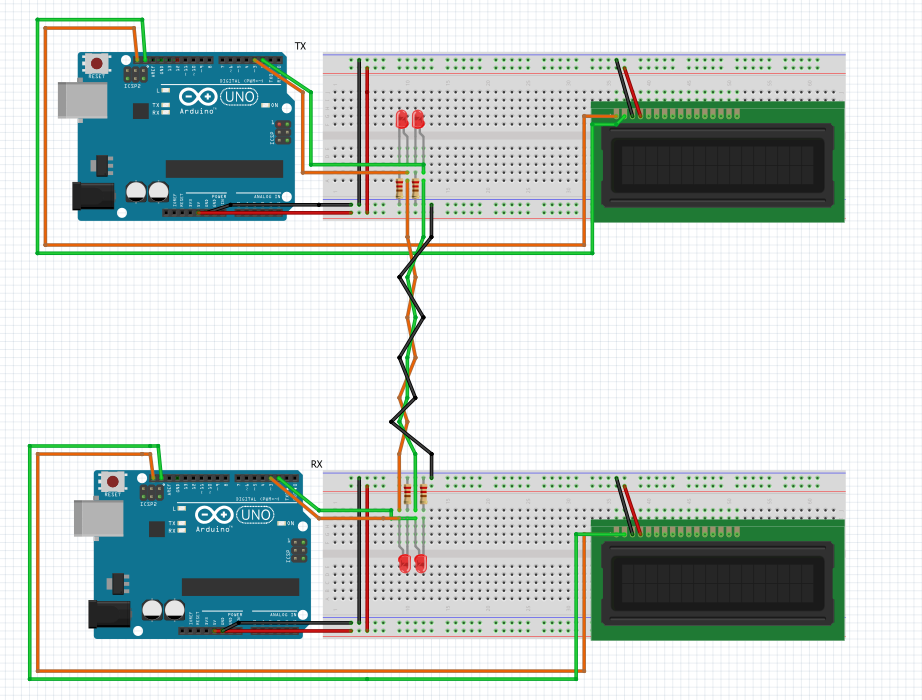
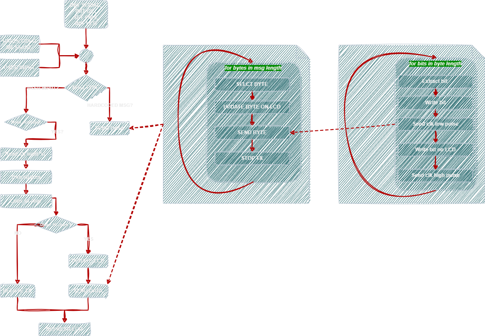
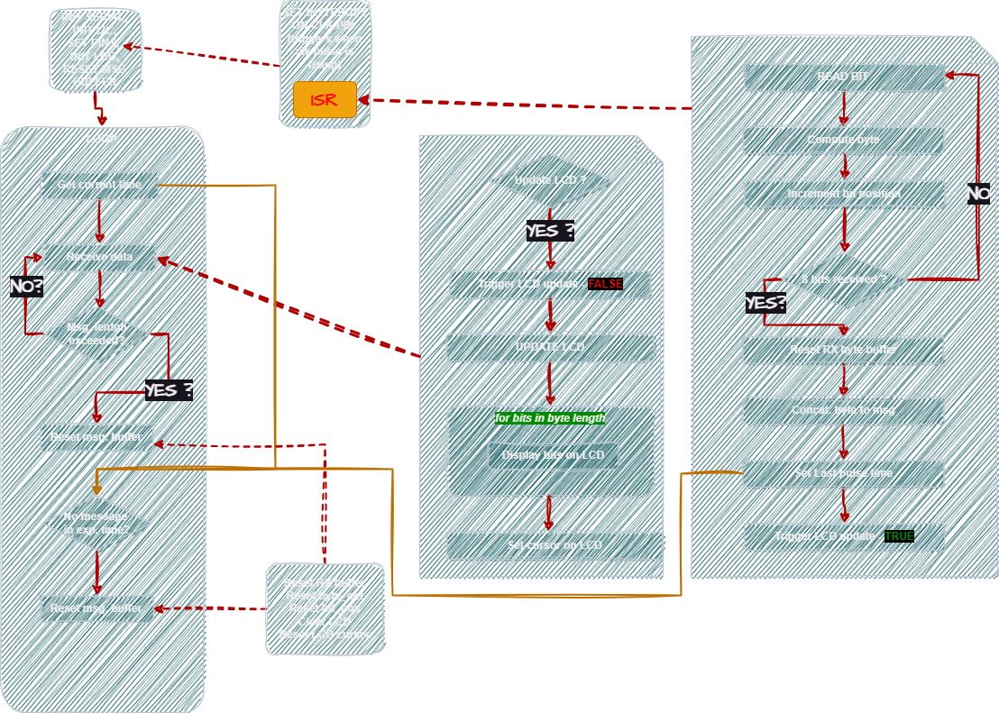
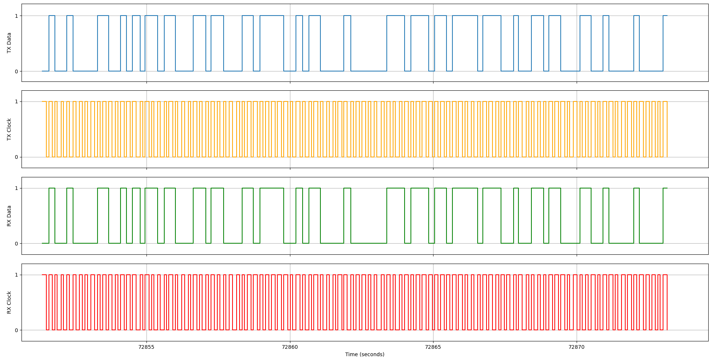
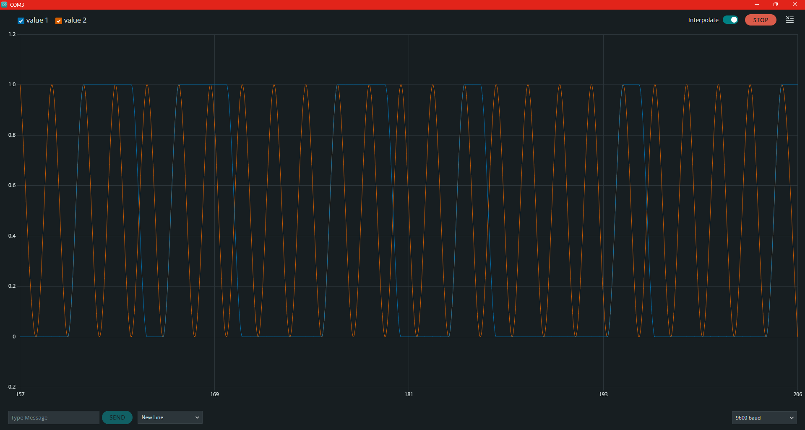

# 📡 Serial_NRZ_ClkSync

**Serial Communication between two Arduino UNO boards using external clock synchronization and NRZ encoding.**

---

## 🧠 Project Summary

We created a custom communication protocol between **two Arduino UNO boards**, using:

- **Serial communication synchronized with a clock signal**
- **NRZ (Non-Return-to-Zero) encoding**
- **User-defined or hardcoded message transmission**
- **Interrupt-based reception**
- **I2C 16x2 LCD visualization**

LEDs are connected to **TX Data / TX Clock** and **RX Data / RX Clock** lines to monitor activity. Communication is done through **twisted-pair cables** to reduce noise.

---

## 📐 Signal Encoding

>   
> _Figure 1: NRZ (Non-Return-to-Zero) encoding – logical 1 is HIGH, 0 is LOW_

---

## 🛠️ Hardware Setup

>   
> _Figure 2: Wiring diagram between transmitter and receiver boards_

**Components:**
- 2x Arduino UNO
- 2x I2C LCD 16x2
- 4x LEDs (for clock/data)
- Breadboards, resistors
- Twisted pair jumpers

---

## 💾 Software Implementation

### 🧾 Transmission (TX)

The transmitter:

- Sends each byte as 8 bits (MSB first)
- Generates a **clock pulse for every bit** at a rate of **5 bps** (200ms per bit)
- Supports both:
  - **Hardcoded messages** (e.g., "Hello, world!")
  - **User input** via Serial Monitor
- Displays live TX bits on LCD

>   
> _Figure 3: TX logic flow_

---

### 🧲 Reception (RX)

The receiver:

- Uses **interrupts on RX Clock (rising edge)**  for low-latency
- Reads **one bit per clock pulse**
- Assembles bits into bytes
- Builds a message string on the LCD

**Reset conditions:**
- If message exceeds **16 characters** (1 LCD line)
- If **no clock pulse is received for 1500 ms**

>   
> _Figure 4: RX logic flow_

---

## 📉 Data Plotting (Python)

Serial output from both boards (DATA + CLOCK) is logged into `.txt` files and plotted using `matplotlib`.

>   
> _Figure 5: TX and RX clock/data signal from Serial Monitor using `matplotlib`_

---

## 🎥 Demo (Live Simulation)

>   
> _GIF 1: Transmission and reception of a hardcoded message_

>   
> _GIF 2: Transmission using user input via Serial Monitor_

>   
> _Figure 6: TX data & clock timing_

>   
> _Figure 7: RX data & clock reconstruction_

---

